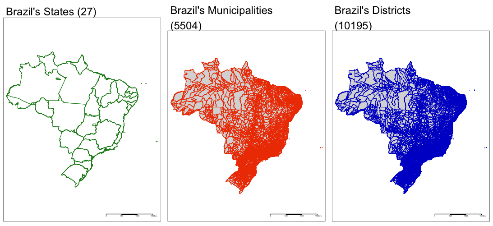

```{r setup, include=FALSE}
# To enable caching for an entire document, add cache = TRUE to the global chunk option defaults:
knitr::opts_chunk$set(cache = TRUE)
```

```{r packages, cache = FALSE, message = FALSE}
# library(tidyverse)
```


## Brazil level 2 boundaries



# Session Info {.toc-ignore}

```{r child='_sessioninfo.Rmd'}
```
